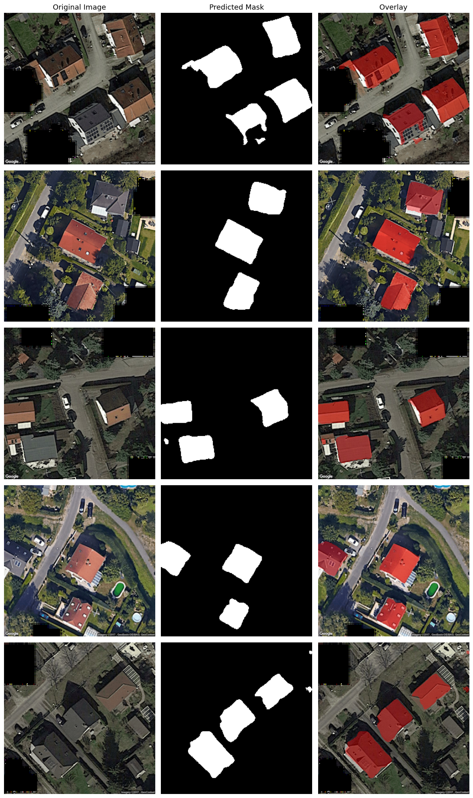

# Satellite Roof Segmentation

Binary semantic segmentation of rooftops from satellite imagery,
motivated by real-world applications in automated solar panel planning.

---

## Overview

Given a satellite image of a residential area, the model predicts a
pixel-wise binary mask where white = roof, black = everything else.
The dataset consists of 30 RGB images (256×256) with 25 corresponding
ground truth masks, leaving 5 unlabeled images as the test set.

The task is challenging for two reasons: the training set is small (20
images after the train/val split), and some labels are noisy — a known
difficulty in satellite imagery annotation.

---

## Approach

I compared two architectures against two loss configurations, training
four models in total and selecting the best based on validation metrics.

**Architectures:**
- U-Net (Ronneberger et al., 2015)
- U-Net++ (Zhou et al., 2018) — improves on U-Net with dense nested
  skip connections that progressively refine features before they reach
  the decoder, reducing the semantic gap at each resolution level

Both use a **ResNet34 encoder pretrained on ImageNet** — with only 20
training images, transfer learning is essential.

**Loss configurations:**
- V1: BCE + Dice loss | Adam optimizer
- V2: BCE + Dice + boundary weighting | Adamax optimizer —
  inspired by published approaches that add extra penalty near roof
  edges to encourage sharper boundaries

**Selected model:** U-Net++ with BCE + Dice loss (V1) achieved the best
validation metrics and was used for final predictions.

---

## Results

| Model | IoU | Dice | Recall |
|---|---|---|---|
| U-Net V1 | 0.747 | 0.856 | 0.834 |
| U-Net V2 | 0.812 | 0.896 | 0.854 |
| **U-Net++ V1** | **0.819** | **0.900** | **0.885** |
| U-Net++ V2 | 0.780 | 0.876 | 0.853 |

Recall is prioritised over precision: in solar planning applications,
a missed roof is a missed potential installation, while false positives
are typically filtered by downstream geometric processing.

---

## Predictions on Test Set

*Original image / Predicted mask / Overlay*

---

## Running the Notebook

The notebook is designed to run on **Google Colab** with a T4 GPU.
Click the badge above to open it directly. The dataset is downloaded
automatically — no manual setup required.

If running locally, install dependencies with:
